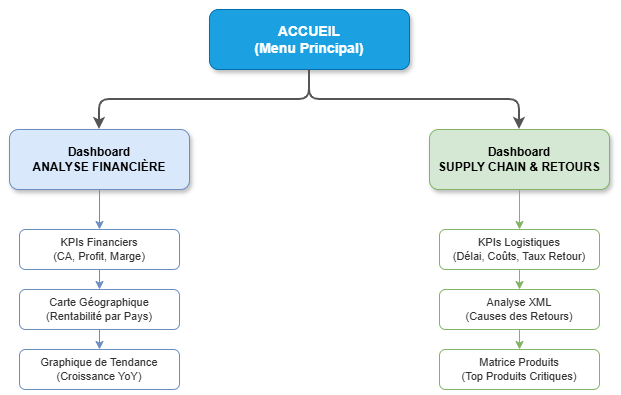
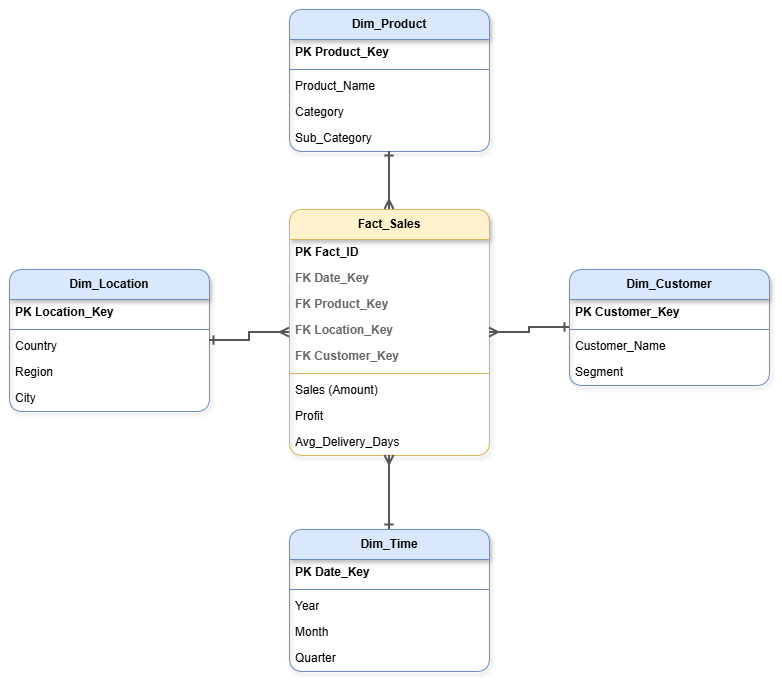

# 🌍 Global Retail 360 - Business Intelligence Solution


> **Course:** GINF3 - Business Intelligence & Data Warehousing  
> **Institution:** ENSA TANGER  
> **Academic Year:** 2025-2026

---

## 📖 Project Overview

**Global Retail 360** is an end-to-end Business Intelligence solution designed to analyze the correlation between **Supply Chain efficiency** (shipping delays) and **Financial Performance** (returns, profit margins).

The project simulates a real-world heterogeneous data environment by aggregating data from **ERP systems (CSV)**, **HR files (Excel)**, and **Logistics partners (XML)** into a central Data Warehouse to drive strategic decision-making.

### 🎯 Key Business Problem
> *"How do logistics delays and shipping modes impact our product return rates and overall profitability across different international markets?"*

---

## Technical Architecture

The solution follows a classic BI pipeline structure:

1.  **Data Sources (Heterogeneous):**
    *   **Sales Data (.csv):** Transactional data (Orders, Revenue).
    *   **HR Targets (.xlsx):** Regional managers and yearly goals.
    *   **Logistics Returns (.xml):** Semi-structured data containing return reasons (e.g., "Defective", "Late Delivery").
2.  **ETL (Extract, Transform, Load):**
    *   **Talend Open Studio:** Orchestrates data integration, parses XML, and handles the `Left Join` logic between Sales and Returns.
    *   **Python:** Used for initial data generation and simulation.
3.  **Data Warehouse:**
    *   **PostgreSQL:** Stores the data in a **Star Schema (Kimball)** format.
4.  **Reporting:**
    *   **Power BI:** Interactive dashboards with DAX calculations, Time Intelligence, and custom UI design (Watercolor theme).

---

## 📂 Project Structure

```bash
Global-Retail-360/
│
├── data/
│   ├── input/              # Raw source files (CSV, XML, XLSX)
│   └── scripts/            # Python script (generate_sources.py)
│
├── etl/
│   └── talend_job/         # Talend Open Studio project files
│
├── sql/
│   └── 01_create_dwh.sql   # SQL script to create Star Schema tables
│  
│
├── docs/
│   ├── architecture_diagram.png
│   ├── star_schema.png
│   └── etl_process.png
│
├── Global_Retail_Dashboard.pbix  # The final Power BI file
└── README.md
```

---

## Data Modeling (Star Schema)

We implemented a dimensional model to optimize query performance for OLAP analysis.

*   **Fact Table:** `Fact_Sales` (Contains metrics: Sales, Profit, Quantity, Shipping Cost, Delivery Days).
*   **Dimension Tables:**
    *   `Dim_Product` (Category, Sub-Category, Name)
    *   `Dim_Location` (Country, Region, City)
    *   `Dim_Customer` (Segment, ID)
    *   `Dim_Time` (Managed via DAX DateTable in Power BI)

> **Key Technical Feature:** The `is_returned` flag in the Fact Table is derived from parsing the XML file and matching `OrderIDs`.

---

## 📊 Dashboards & Features

The Power BI report is divided into 3 interactive pages with a custom navigation menu.

### 1. 🏠 Home Page
A central landing page with a custom artistic UI (Watercolor/Aquarelle theme) providing navigation to the functional areas.

### 2. 💰 Financial Analysis
Focused on the CFO's needs.
*   **KPIs:** Total Revenue, Profit, Margin %.
*   **Geo-Analysis:** Map highlighting profitable vs. unprofitable regions.
*   **Time Intelligence:** Year-over-Year (YoY) growth analysis.
*   **Top Products:** Pareto analysis of most profitable sub-categories.

### 3. 🚚 Supply Chain & Returns (The "Tech Core")
Focused on the Logistics Manager's needs.
*   **XML Analysis:** Donut chart showing return reasons (proof of XML ingestion).
*   **Correlation Analysis:** Scatter plot showing the impact of "Average Delivery Days" on "Return Rate %".
*   **Performance Matrix:** Identification of "Problem Products" (High returns + Long delays).

---

## ⚙️ Installation & Setup Guide

Follow these steps to reproduce the environment locally.

### Prerequisites
*   Python 3.x (with pandas)
*   Talend Open Studio for Data Integration
*   PostgreSQL (Localhost)
*   Power BI Desktop (Windows)

### Step 1: Generate Data
Run the Python script to generate the simulated source files.
```bash
pip install -r requirements.txt
cd scripts
python generate_sources.py
```
*Output: Files will be created in `data/input/`.*

### Step 2: Prepare Database
Open **pgAdmin** or **DBeaver** and run the SQL script `sql/01_create_dwh.sql` to create the `GlobalRetailDW` database and empty tables.

### Step 3: Run ETL Process
1.  Open **Talend Open Studio**.
2.  Import the project from the `etl/` folder.
3.  Update the **Metadata** (File paths and DB connection settings) to match your local machine.
4.  Run the Job `Job_GlobalRetail_Load`.
5.  *Verify:* Check `Fact_Sales` in PostgreSQL to ensure data is loaded.

### Step 4: Launch Dashboard
1.  Open `Global_Retail_Dashboard.pbix`.
2.  If prompted, update the Data Source settings to point to your local PostgreSQL instance.
3.  Click **Refresh**.

---

## 🖼️ Gallery


| Architecture | Star Schema |
| :---: | :---: |
|  |  |

---

## 📜 License & Acknowledgments

*   **Data Source:** Based on the "Global Superstore" dataset (Kaggle), modified for educational purposes.
*   **Icons:** Flaticon / Power BI native icons.
*   **Background:** Custom Aquarelle texture.
